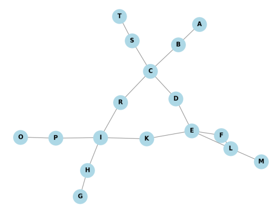

# Тема 6. Графи

### Завдання 1

Створіть граф за допомогою бібліотеки `networkX` для моделювання певної реальної мережі (наприклад, транспортної мережі міста, соціальної мережі, інтернет-топології).

Візуалізуйте створений граф, проведіть аналіз основних характеристик (наприклад, кількість вершин та ребер, ступінь вершин).

    Реальну мережу можна вибрати на свій розсуд, якщо немає можливості придумати свою мережу, наближену до реальності.

### Завдання 2

Напишіть програму, яка використовує алгоритми `DFS` і `BFS` для знаходження шляхів у графі, який було розроблено у першому завданні.

Далі порівняйте результати виконання обох алгоритмів для цього графа, висвітлить різницю в отриманих шляхах. Поясніть, чому шляхи для алгоритмів саме такі.

### Аналіз

### Результати роботи алгоритмів

- **DFS (глибина першого пошуку):** `A B C D E F L M K I H G P O R S T`

- **BFS (ширина першого пошуку):** `A B C R S D I T E H P K F L G O M`

## Пояснення різниці в шляхах

Алгоритми DFS та BFS використовують різні підходи до обходу графа, що й зумовлює різницю в послідовності відвіданих вершин:

### DFS (Depth-First Search)

- Пріоритет надається **заглибленню** в граф — алгоритм іде по одному шляху до кінця, поки є неперевірені вершини.
- Внаслідок цього вершини, що знаходяться "глибше" в ієрархії графа, відвідуються раніше.
- Порядок обходу: рух від A до B, далі до C, потім до D і так далі, поки не буде досягнуто найглибшої вершини. Після цього алгоритм "відкатується" назад до розгалужень.

### BFS (Breadth-First Search)

- Вершини обробляються **за рівнями** — спочатку всі сусіди поточної вершини, потім сусіди їхніх сусідів тощо.
- Такий підхід забезпечує відвідання ближчих вершин раніше, ніж далеких.
- Порядок обходу: спочатку A, потім всі сусіди A (B, C, R, S), далі всі їхні сусіди (D, I, T), і так далі.

## Висновки

1. **Різниця в порядку обходу обумовлена структурою самого алгоритму:**
 - DFS пріоритезує глибину, йде "вглиб" графа.
 - BFS пріоритезує ширину, обходить "рівень за рівнем".

2. **DFS зручний для задач, де важливо знайти шлях до глибоких вузлів (наприклад, пошук рішення в лабіринті або пошук компонент зв'язності).**

3. **BFS ефективний для знаходження найкоротших шляхів у невагомих графах (оскільки найшвидше дістається до вершин, найближчих до стартової).**

4. **Вибір алгоритму залежить від конкретної задачі.** В даному випадку, наочно видно, що DFS і BFS відвідують одні й ті ж вершини, але у зовсім іншому порядку, що ілюструє різні стратегії пошуку.

---

## Завдання 3

Реалізуйте `алгоритм Дейкстри` для знаходження найкоротшого шляху в розробленому графі: додайте у граф ваги до ребер та знайдіть найкоротший шлях між всіма вершинами графа.
